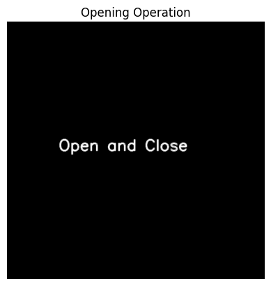
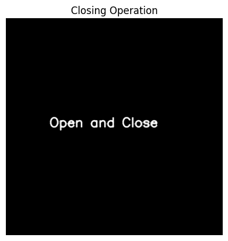

# OPENING--AND-CLOSING
## Aim
To implement Opening and Closing using Python and OpenCV.

## Software Required
1. Anaconda - Python 3.7
2. OpenCV
## Algorithm:
### Step1:
Import the necessary pacakages


### Step2:
Create the text using cv2.putText

### Step3:
Create the structuring element

### Step4:
Erode the image

### Step5:
Dilate the Image
 
## Program:

``` Python
# Import the necessary packages
import cv2
import numpy as np
from matplotlib import pyplot as plt
     

# Create a blank image
image = np.zeros((500, 500, 3), dtype=np.uint8)

# Add text on the image using cv2.putText
font = cv2.FONT_HERSHEY_SIMPLEX
cv2.putText(image, 'Open and Close', (100, 250), font, 1, (255, 255, 255), 2, cv2.LINE_AA)


# Create a simple square kernel (3x3)
kernel = np.ones((3, 3), np.uint8)

# Display the input image
plt.imshow(cv2.cvtColor(image, cv2.COLOR_BGR2RGB))  # Convert BGR to RGB for displaying
plt.title("Input Image with Text")
plt.axis('off')
```


```python

# Opening is erosion followed by dilation
opened_image = cv2.morphologyEx(image, cv2.MORPH_OPEN, kernel)

# Display the result of Opening
plt.imshow(cv2.cvtColor(opened_image, cv2.COLOR_BGR2RGB))  # Convert BGR to RGB
plt.title("Opening Operation")
plt.axis('off')
```

```python
# Use Closing Operation
# Closing is dilation followed by erosion
closed_image = cv2.morphologyEx(image, cv2.MORPH_CLOSE, kernel)
# Display the result of Closing
plt.imshow(cv2.cvtColor(closed_image , cv2.COLOR_BGR2RGB))  # Convert BGR to RGB
plt.title("Closing Operation")
plt.axis('off')

```



## Result
Thus the Opening and Closing operation is used in the image using python and OpenCV.